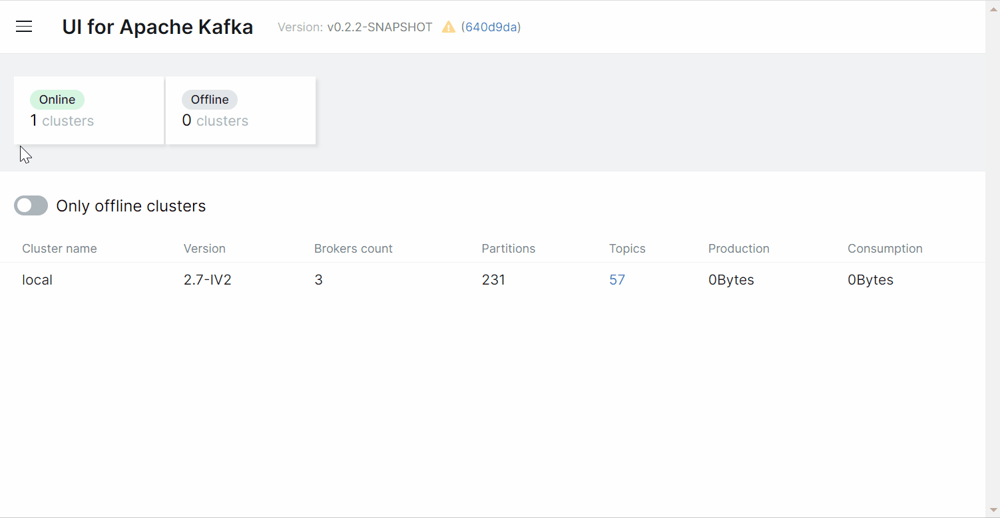

## UI for Apache Kafka

### Демо интерфейса

### Запуск

* `docker-compose -f kafka-ui.yml up` - Дефолтная конфигурация с 2 Kafka Clusters и 2 нодами Schema Registry, 1 kafka-connect и несколько тестовых топиков.
* `docker-compose -f kafka-ui-arm64.yml up` - Дефолтная конфигурация для ARM64 (Mac M1) архитектуры с 1 Kafka Cluster без Zookeeper с одной нодой Schema Registry, 1 kafka-connect и несколько тестовых топиков.

Kafka-UI интерфейс будет доступен по адресу `http://localhost:8080/` после запуска Docker Compose.

### Дополнительные ссылки

Документация: https://docs.kafka-ui.provectus.io/overview/readme

Git репозиторий: https://docs.kafka-ui.provectus.io/configuration/helm-charts/quick-start

Больше примеров Docker кофигураций: https://github.com/provectus/kafka-ui/blob/master/documentation/compose/DOCKER_COMPOSE.md
